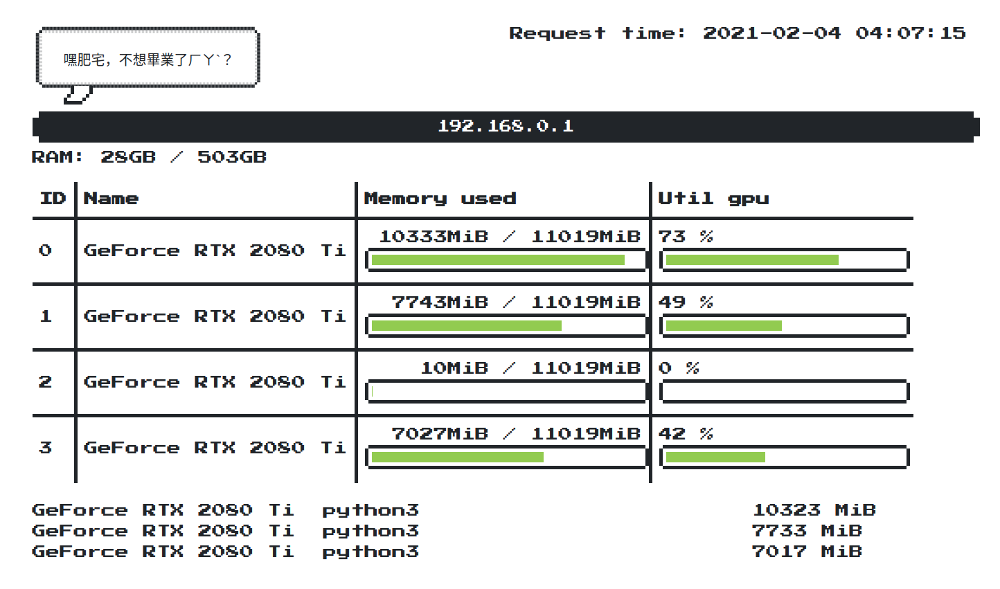

## Installation

```shell
git clone https://github.com/kehanlu/server-monitor
cd server-monitor
pip install -r requirements.txt
```

- `nvidia-smi`: https://www.nvidia.com

## Usage

### Server

"Server" means the servers you want to monitor.

1. Go to server you want to monitor
    - You have to be sure that `nvidia-smi` command is installed.

2. run the command to start an API.

```shell
uvicorn server:app --host 0.0.0.0 --port 23333
```

Note:
This is still an early project, the best way is you serve this application by nginx or other services.


### Master

"Master" means the web server which is going to fetch data from each servers. You can run this web server on any computer. In some case, you might want this web server are accessible from public network, but still put servers behind a firewall.

1. create a file named `config.py`

2. In `config.py`, you need to have a list of server ips. Then the web server will iterate from the list and GET the API at `http://{ip}:23333`.

```python
server_ips = [
    "192.168.0.1",
    "192.168.0.3",
    "192.168.0.4"
]
```

3. run the command to start the server.

```shell
export FLASK_APP=master.py
flask run --host 0.0.0.0 --port 8787
```

4. Visit `127.0.0.1:8787` or `<your_ip>:8787` to see the website.

## Screenshots



## Contribution

Pull requests are welcome. This is still an early project (and just for fun).

TODOs:

[x] Handle error.
[x] Use Nginx to serve the sites.
[x] Use CI/CD to automatically update projects on servers.